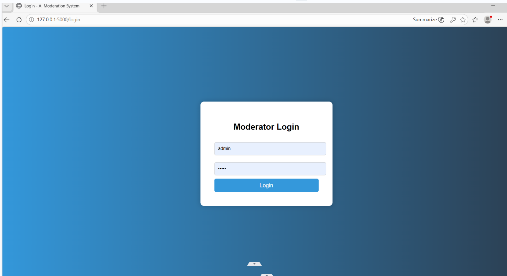
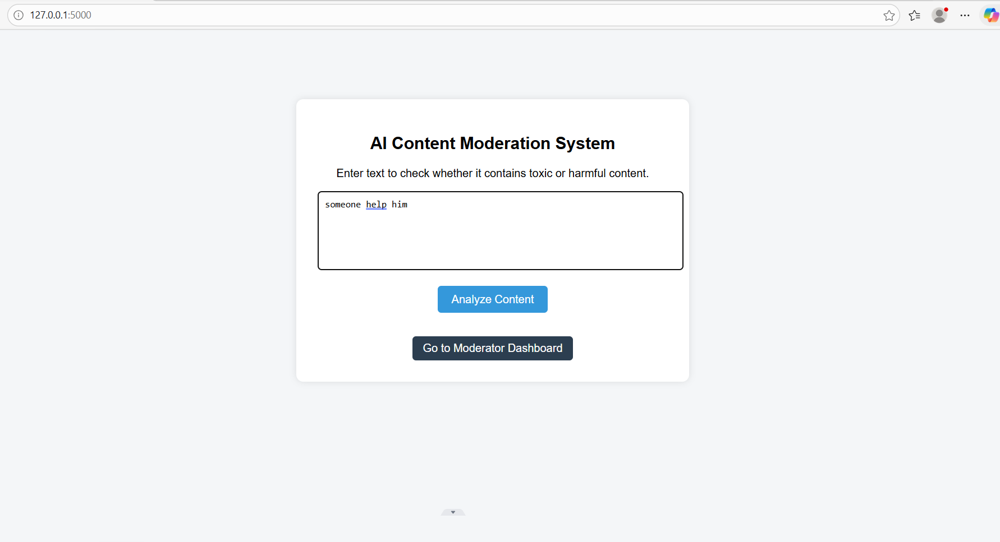
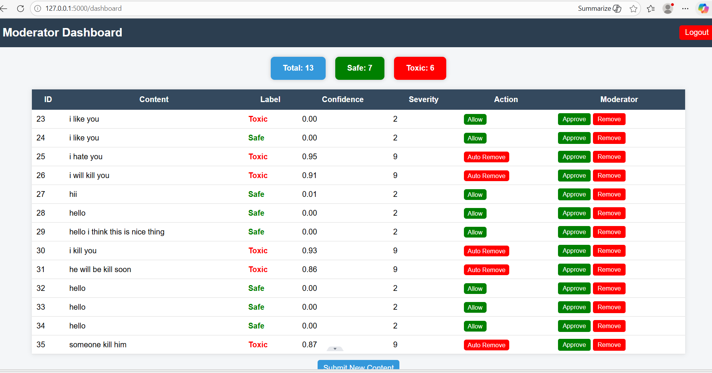

# 🤖 AI-Powered Content Moderation & Policy Enforcement Platform

## Overview

This project is an AI-powered content moderation system that detects toxic or harmful text using machine learning models. It analyzes user input and applies moderation actions like allow, review, or remove.

## Features

* Admin login system
* User content submission
* AI toxicity detection (Toxic-BERT)
* Moderation result with confidence score
* Moderator dashboard with statistics
* Logging system

## Technologies Used

* Python
* Flask
* HuggingFace Transformers
* Toxic-BERT
* SQLite
* HTML, CSS

## Application Pages

* Login Page → Admin login required
* Submit Page → User enters text
* Result Page → Shows prediction, confidence, action
* Dashboard → View all posts, approve/remove content

## Project Structure

app.py → Backend logic
templates/ → HTML pages
database.db → Database
screenshots/ → Project images

## Installation & Run

git clone https://github.com/shakshiagrawalcsaiml/AI-Powered-Content-Moderation-Policy-Enforcement-Platform.git
cd AI-Powered-Content-Moderation-Policy-Enforcement-Platform
pip install -r requirements.txt
python app.py

Open: http://127.0.0.1:5000/login

## Login Credentials

Username: admin
Password: admin

## Screenshots

Login Page

Submit Page

Result Page

Dashboard

## Testing

Tested with inputs like:

* hello
* good morning
* I hate you
* I will kill you

## Team Members

Shakshi Agrawal
Bharat Gautam

## Conclusion

This project shows how AI can be used to detect and control harmful content effectively.
