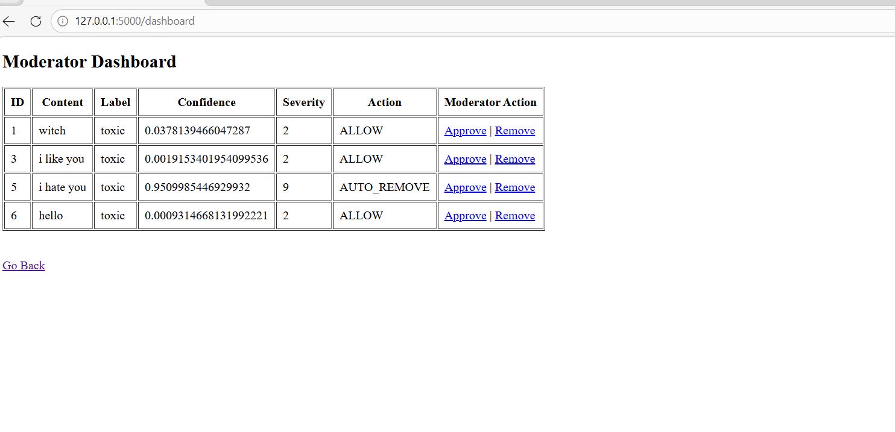

# AI-Powered Content Moderation & Policy Enforcement Platform

## Overview
This project is an AI-powered content moderation system that detects toxic or harmful text using machine learning models.

## Technologies Used
- Python
- Flask
- HuggingFace Transformers
- Toxic-BERT
- SQLite
- HTML

## Features
- User content submission form
- AI toxicity detection
- Policy decision engine
- Database storage
- Moderator dashboard

## Project Structure
app.py → Flask backend logic  
templates/ → HTML pages  
submit.html → user submission form  
dashboard.html → moderator dashboard  
database.db → stores moderation results
## Team Members
Shakshi Agrawal  
Bharat Gautam
## Installation & Running the Project

1. Clone the repository

git clone https://github.com/shakshiagrawalcsaiml/AI-Powered-Content-Moderation-Policy-Enforcement-Platform.git

2. Move into the project folder

cd AI-Powered-Content-Moderation-Policy-Enforcement-Platform

3. Install dependencies

pip install -r requirements.txt

4. Run the Flask application

python app.py

5. Open the browser and go to

http://127.0.0.1:5000
## Screenshots

### Content Submission Page
.png)

### Moderator Dashboard

